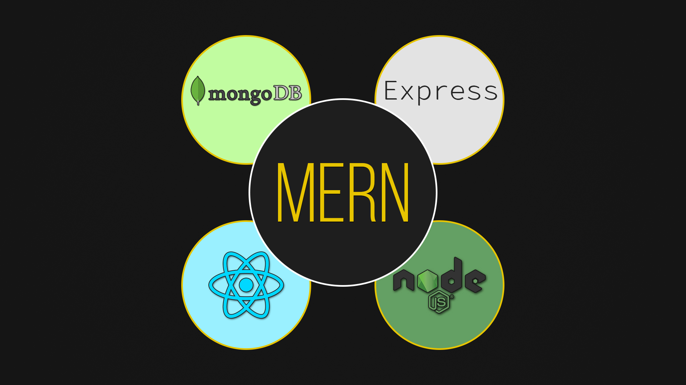

# MernCourse

Este projeto eu fiz durante o curso React, NodeJS, Express & MongoDB - The MERN Fullstack Guide da  Academind.

## Funcionalidades

- Autenticação 
- Autorização
- Upload de imagens
- CRUD
- Uso da API Geocoding do Google para converter um endereço em coordenadas

## API

([Veja aqui o repositório da API deste projeto](https://github.com/GuilhermeCCunha/mern-backend)).

## Como usá-lo

1. Baixe este repositório clicando no botão verde **Code** no topo da página e clicando na opção **Download ZIP**.

2. Acesse a pasta raiz do projeto em seu terminal;

3. Execute `npm install` para instalar todas as dependências do projeto (você deve ter [Node.js](https://nodejs.org/en/download/) instalado);

4. Para iniciar a aplicação, execute `npm start` em seu terminal. Navegue até `http://localhost:3000/`. A aplicação será recarregada automaticamente se você alterar algum dos arquivos de origem.
